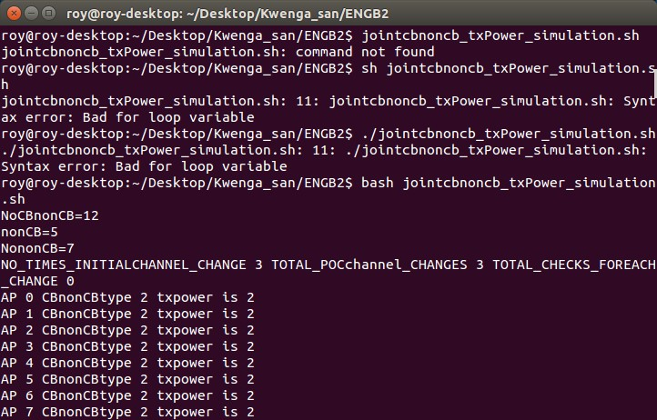
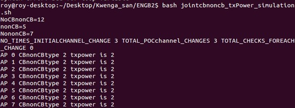

# Bash-Scripting-Error-Solve
# Error 1: Syntax error: Bad for loop variable
If you face the following error When you are trying to run a bash script

Then follow the following command to run the bash script

$ bash filename.sh

